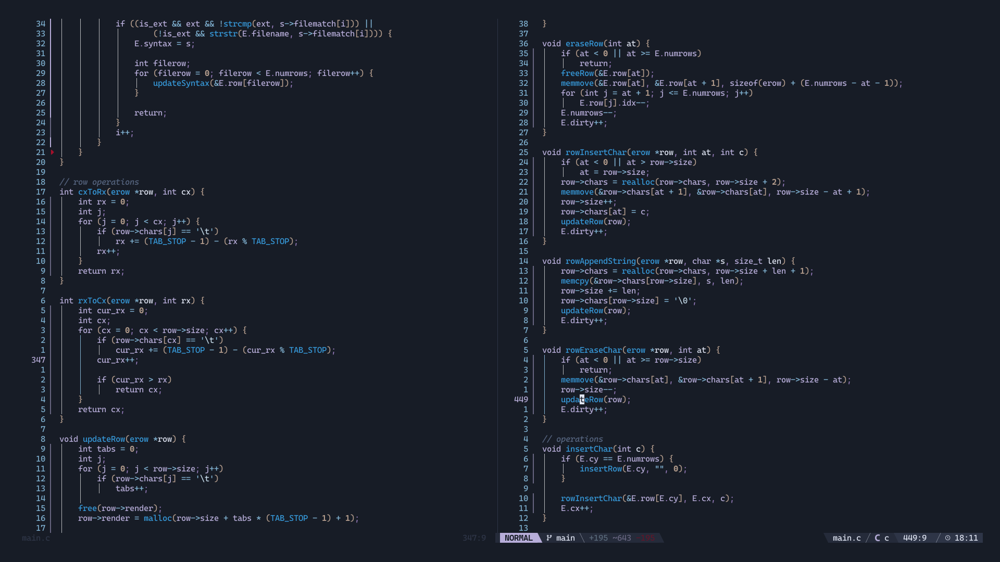

# Hesperus Nvim

### Screenshot


<br></br>

### Installation

#### Lazy:
```lua 
{
    "hesperus-theme/hesperus.nvim",
    lazy = false,
    priority = 1000,
}
```

<br></br>

### Usage:
Add this to your init.lua:

```lua
vim.cmd.colorscheme("hesperus")
```

or simply run:

```lua
:colorscheme hesperus
```

NOTE: This theme is not exclusive to Neovim! The `ports` folder contains one subfolder for each piece of software the colorscheme was already ported to.

<br></br>

#### Credits
- [datsfilipe](https://github.com/datsfilipe) for their awesome [colorscheme-template](https://github.com/datsfilipe/nvim-colorscheme-template.git)

<br></br>

<p style="text-align: center;">Copyright &copy; 2026 - <a href="https://github.com/tachyonora" target="_blank">tachyonora</a></p>
